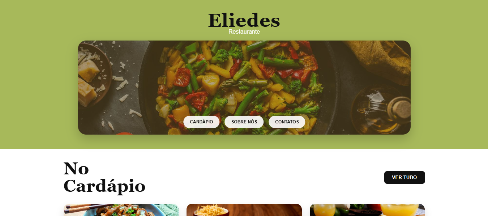

# 🍽️ Landing Page — Eliedes Restaurante

Website institucional desenvolvido por Lucas Rosa utilizando HTML, CSS e JavaScript.
O objetivo do site é apresentar o cardápio do restaurante, mostrar informações do estabelecimento e facilitar o contato direto com clientes.

## ✨ Funcionalidades

- 📱 Layout totalmente responsivo (desktop, tablet e celular)
- 🍛 Exibição de pratos do cardápio
- 🔎 Botão "Ver tudo" para expandir mais opções
- 📲 Clique no prato abre conversa automática no WhatsApp
- 🏪 Seção "Sobre nós" com apresentação do restaurante
- 🔗 Links diretos para WhatsApp e Instagram
- ⚡ Animações suaves ao rolar a página

## 🛠️ Tecnologias utilizadas

- HTML5 → Estrutura semântica da página
- CSS3 → Estilização, layout e responsividade
- JavaScript → Interatividade, animações e integração com WhatsApp

## 🎯 Objetivo

Praticar desenvolvimento Front-End aplicando conceitos de responsividade, manipulação do DOM e experiência do usuário em um projeto voltado para um cliente real.

## 📸 Preview

